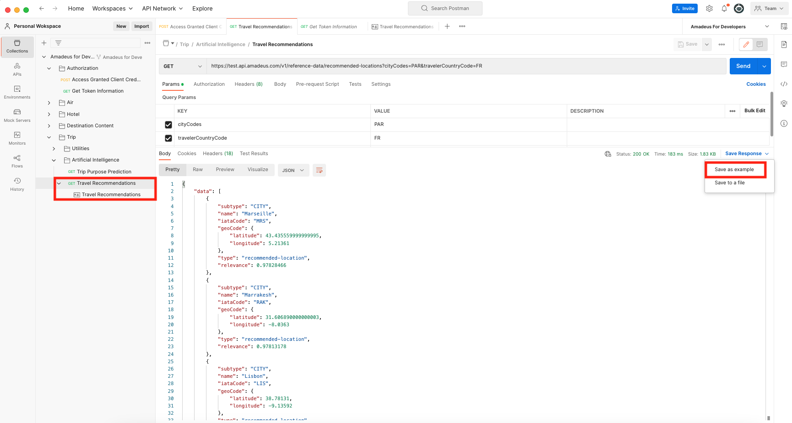
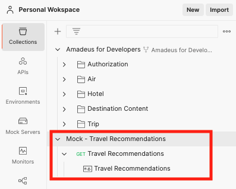
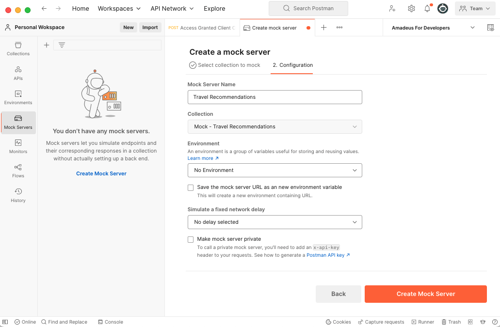
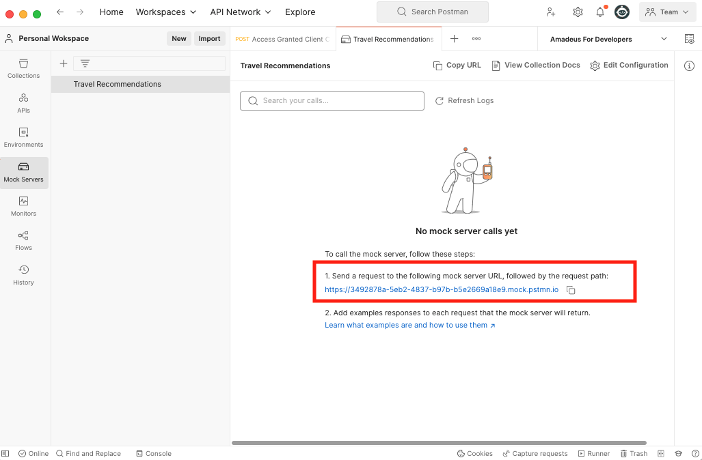
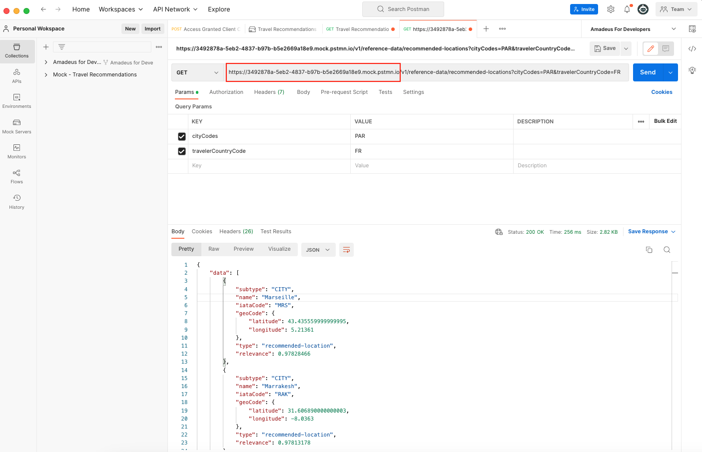

## Build a Mock Server with Postman

Mock servers can be used as a tool for testing APIs. They simulate the behavior of a real server allowing developers to test their applications without calling the real service. 

Let's say that you want to build the frontend of your travel application without consuming your [free quota](https://developers.amadeus.com/pricing) to call the Amadeus for Developers APIs. In this tutorial show you how to build a mock server.

### Prerequisites
- A [Postman account](https://www.postman.com/) and it's app or web version
- The [Amadeus for Developers Postman collection](https://www.postman.com/amadeus4dev) forked into your workspace 

Let's now check step-by-step to create a mock server.

### 1. Save a request and response example

For the sake of the tutorial we will show you how to create a mock server for the [Travel Recommendations API](https://developers.amadeus.com/self-service/category/trip/api-doc/travel-recommendations). We will make one request to the Amadeus API and then we will mock the request and response. To learn how to make an API call with Postman, please check this step-by-step [guide](/docs/developer-tools/postman.md).

Open your Postman application and generate your Amadeus `access token` as described in the guide above. Then go to **Amadeus for Developers > Trip > Artificial Intelligenge > GET Travel Recommendations**  and make an API call.

Click on **Save Response > Save as example**, and in the same directory you will see the example that you just saved within your collection.

### 2. Add the API and example in a new collection 

In Postman, you always need to create a mock server for a whole collection. That's why in this case you will create a new collection to contain only the API we are going to mock. 

Let's create a new Postman collection. On the top left of your screen click **New > Collection** and you will see the new collection with the name `New Collection`. Feel free to give another name, in our case is called  `Mock - Travel Recommendations`.

Now you are able to add the Travel Recommendations API to the collection. To do so, duplicate the `GET Travel Recommendations` API, which can be found at the collection **Amadeus for Developers > Trip > Artificial Intelligenge > GET Travel Recommendations** and drag & drop it your new collection. Your workspace will now look like: 

### 3. Build the mock server

In order to create a mock server go to **New > Mock Server > Select an existing collection** and choose the collection you just created. 

In the next step you can see several options to configure your server. Give a name and click the **Create a Mock Server** button.

The mock server generates a URL in which your requests will be sent to. Make sure to copy the URL because you will need it for the next step.

For this tutorial you built a public mock server, which means that anyone with access to the URL will be able to perform requests. If you want to keep it private, you will have to get a [Postman API key](https://learning.postman.com/docs/developer/intro-api/) and pass it to the request headers.

### 4. Send a request to the mock server 

On the top left click on **New > HTTP Request** and create a `GET` request. For the base URL use the mock server's one, and contatenate the same path and parameters from the saved example. The full request now looks like:

`GET https://3492878a-5eb2-4837-b97b-b5e2669a18e9.mock.pstmn.io/v1/reference-data/recommended-locations?cityCodes=PAR&travelerCountryCode=FR`

Perform the API request and you will get as response, the one that we saved earlier.

You can also paste the full URL in your browser and get the results, since it's a public mock server.

Congratulations! You've created a mock server in Postman. You can now use this server in your code to mock several requests, successful responses and error messages according to your development needs.