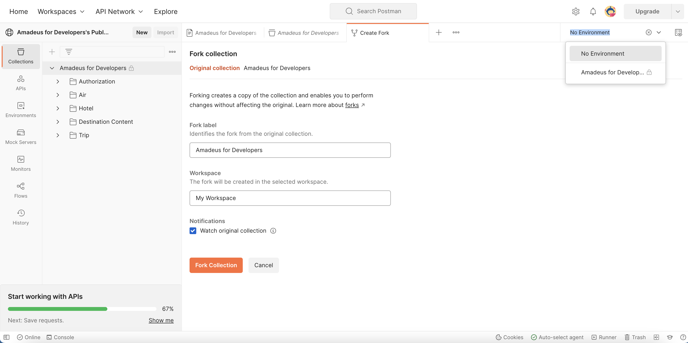
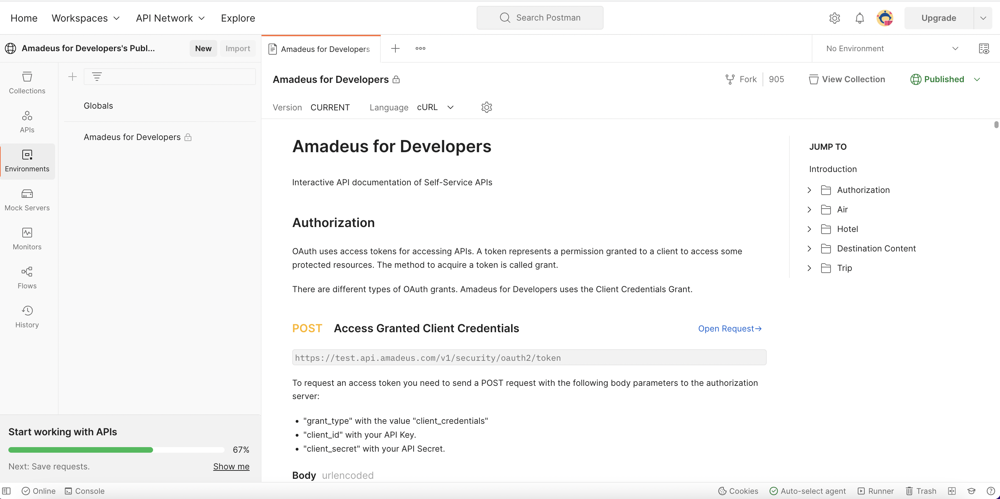
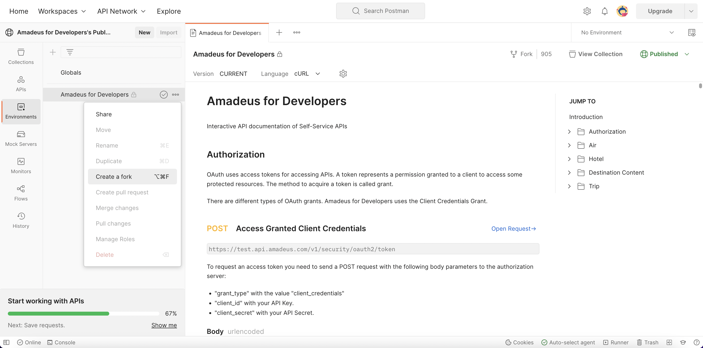
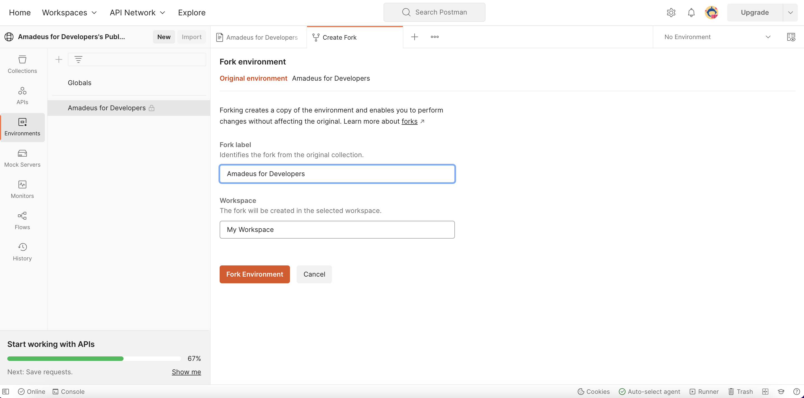
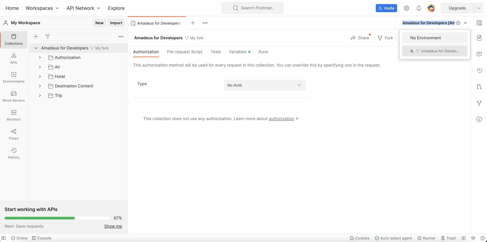
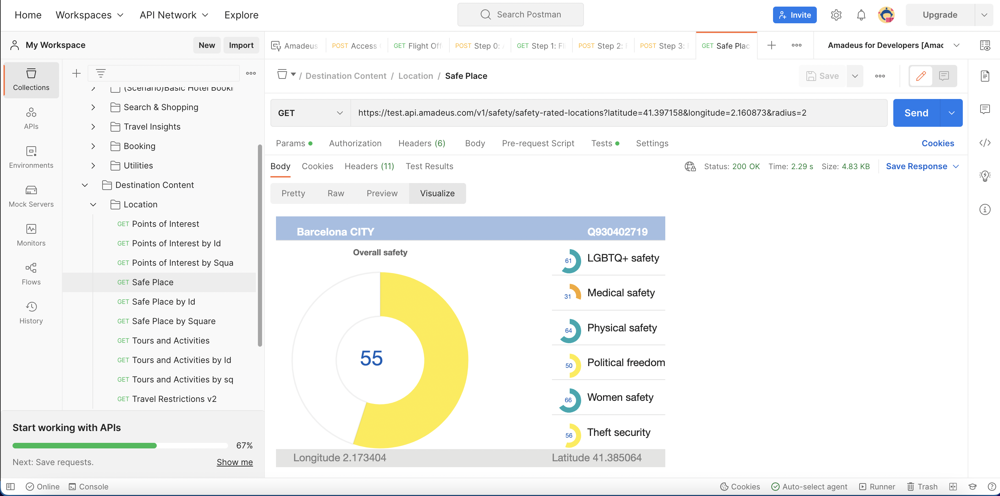

# Self-Service API Postman collection

Follow this tutorial to test Amadeus Self-Service APIs using our dedicated Postman collection.

## Pre-requisites

Before you begin, you need to:

* Register your application with Amadeus for Developers as described in [Making your first API call](../quick-start.md).
* Create a new Postman account or use your existing Postman account.

## Fork the collection

1. Login to Postman.
2. Navigate to the Amadeus for Developers [public workspace](https://www.postman.com/amadeus4dev/workspace/amadeus-for-developers-s-public-workspace/documentation/2672636-27471449-d2ca-a8c4-1399-6b0cfbddd079).

    

3. Click **Fork**.
4. Select **Amadeus for Developers** from the **Environment** dropdown.

    

5. Give the fork a name.
6. Select the workspace where you need to fork the collection to.
7. Tick the **Watch original collection** box to get notified when the collection is updated.
8. Click **Fork Collection**. You will be taken to the workspace that you selected previously.

## Fork the environment

1. Navigate to the Amadeus for Developers [public workspace](https://www.postman.com/amadeus4dev/workspace/amadeus-for-developers-s-public-workspace/documentation/2672636-27471449-d2ca-a8c4-1399-6b0cfbddd079).

    

2. On the left side bar, click **Environments**.

    

4. Select **...** beside the **Amadeus for Developers** envoronment and select **Create a fork**.

    

5. Give the fork a name.

    

6. Select the workspace where you need to fork the collection to.
8. Click **Fork Environment**. You will be taken to the workspace that you selected previously.

## Generate the access token

1. On the right side bar, set the environment to **Amadeus for Developers**.

    

2. On the left side bar, click **Environments**.

    

3. Enter you [API key and secret values](/API-Keys/authorization/) into the **Current** values of the `client_id` and `client_secret` parameters respectively.
4. Click **Save**.
5. On the left side bar, navigate to **Collections**.
6. Select the **Authorization > Access Granted Client Credentials**.
7. Click **Send** without filling out any parameters.
8. You will receive the **access_token** value in the response.

!!! Note
    The token is valid for 30 minutes and you must perform the previous step every 30 minutes to generate a new access token.

## Make an API call

1. Select the required API from the collection by navigating to the required endpoint on the left side bar. For example, **Air > Search & Shopping > Flight Offers Search**.
2. Do not specify the `client_id` and `client_secret` parameters, as the **access_token** obtained previously is already linked to this API.
3. If required, specify the request parameters. Alternatively, you can try the API without setting any parameters, as we have already preconfigured it to display data for the upcoming month.
4. Click **Send** to make the call.

    

## Make our preconfigured scenarios

To give you a smooth user experience that emulates the actual workflow of a flight and hotel booking engine, we have included Scenarios in the **Air** and **Hotel** categories. A scenario combines all required APIs to achive a certain goal (e.g., book a flight) and uses data from each of the API's responses for calling the next API.

1. Select the required scenario from the collection by navigating to the required category on the left side bar. For example, **Air > (Scenario)Basic Flight Booking flow**.
2. Refresh the **access_token** by calling the Authorization API.
3. Make a call to the **Flight Offers Search** to get the offer as a JSON object.
4. Make a call to the **Flight Offers Price** to get the the price for the offer retrieved in the previous step. This API will automatically use the JSON object of the flight offer search.
5. Make a call to the **Flight Create Orders** to create an order for the offer retrieved in the previous steps. 

## Visualize API responses

Some APIs in our Postman include a visualization to present the results graphically for better understanding and interpretation.

To access a visualization of an API:

1. Select the required API from the collection by navigating to the required endpoint on the left side bar. For example, **Destination Content > Location > Safe Place**.
2. Specify the API parameters.
3. Click **Send** to make the call.
4. Click **Visualize** at the bottom of the screen.

    